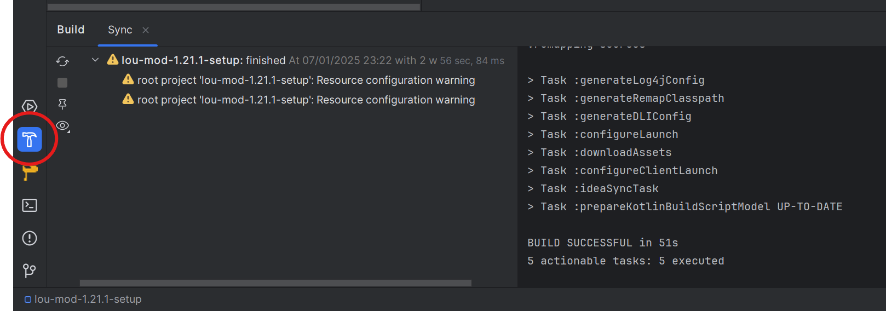

# Workshop Minecraft Mods met Java

Tijdens deze workshop leer je hoe je je eigen Minecraft-mods kunt maken. Mods geven je de mogelijkheid om je eigen dingen 
toe te voegen aan Minecraft, zoals het toevoegen van nieuwe voorwerpen, blokken en gereedschappen. Dit project versterkt 
ook je kennis van Java en Object-Oriented Programming (OOP).

Wat gaan we doen? Je leert:
* Hoe je je Java omgeving voor modding opzet.
* Hoe je ingrediënten, blokken en tools toevoegt aan Minecraft.
* Hoe je de Fabric modding tool gebruikt.

Deze workshop is gebaseerd op de volgende [YouTube series](https://www.youtube.com/watch?v=oU8-qV-ZtUY&list=PLKGarocXCE1H_HxOYihQMq0mlpqiUJj4L)  en de [Fabric wiki](). Kijk hier vooral rond als je in je vrije 
tijd nog meer wilt leren.

## **Inhoudsopgave**

1. [Introductie](#workshop-minecraft-mods-met-java)
2. [Opzetten van je omgeving](#1-opzetten-van-je-omgeving)
    - [1.1. Installeren van Java 21](#11-installeren-van-java-21)
    - [1.2. Installeren van JetBrains IntelliJ](#12-installeren-van-jetbrains-intellij)
    - [1.3. Het opzetten van je Mod project](#13-het-opzetten-van-je-mod-project)
3. [Opstarten van je Minecraft Client](#2-opstarten-van-je-minecraft-client)
    - [2.1. Aanmaken van [ModNaam]Client](#21-aanmaken-van-modnaamclient)
    - [2.2. Aanpassen van `fabric.mod.json`](#22-aanpassen-van-fabricmodjson)
    - [2.3. Opstarten van Minecraft Client](#23-opstarten-van-minecraft-client)
4. [Toevoegen van je eerste Ingredient](#3-toevoegen-van-je-eerste-ingredient)
    - [Voorbereiding](#voorbereiding)
    - [3.1. Aanmaken van de `ModItems` Class](#31-aanmaken-van-de-moditems-class)
    - [3.2. Registreren van je eerste item](#32-registreren-van-je-eerste-item)
    - [3.3. JSON](#33-json)
    - [3.4. Opstarten van Minecraft](#34-opstarten-van-minecraft)
    - [3.5. Veelvoorkomende problemen](#35-veelvoorkomende-problemen)
5. [Toevoegen van je tweede ingredient](#4-toevoegen-van-je-tweede-ingredient)
    - [4.1. Java](#41-java)
    - [4.2. JSON](#42-json)
    - [4.3. Minecraft opnieuw opstarten](#43-minecraft-opnieuw-opstarten)
    - [4.4. Controle](#44-controle)
6. [Toevoegen van je eerste block](#5-toevoegen-van-je-eerste-block)
    - [5.1. Java](#51-java)
    - [5.2. JSON](#52-json)
    - [5.3. Minecraft opnieuw opstarten](#53-minecraft-opnieuw-opstarten)
    - [5.4. Veelvoorkomende problemen](#54-veelvoorkomende-problemen)
7. [Toevoegen van een tweede block](#6-toevoegen-van-een-tweede-block)
    - [6.1. Java](#61-java)
    - [6.2. JSON](#62-json)
    - [6.3. Minecraft opnieuw opstarten](#63-minecraft-opnieuw-opstarten)
    - [6.4. Veelvoorkomende problemen](#64-veelvoorkomende-problemen)
8. [Toevoegen van Tools](#6-toevoegen-van-tools)
    - [6.1. Java: ToolMaterial](#61-java-toolmaterial)
    - [6.2. Java: Tools Registreren](#62-java-tools-registreren)
    - [6.3. JSON en Textures](#63-json-en-textures)
    - [6.4. Minecraft Opstarten](#634-minecraft-opstarten)
    - [6.5. Veelvoorkomende Problemen](#635-veelvoorkomende-problemen)
9. [Goed gedaan!](#goed-gedaan)


## 1. Opzetten van je omgeving
We moeten enkele dingen installeren voordat we kunnen beginnen aan onze mod. Dit is namelijk:
1. Java 21: Minecraft draait volledig op Java. Dit betekent dat je deze programmeertaal moet installeren om je mods te maken en te testen.
2. JetBrains IntelliJ: Een krachtige IDE (Integrated Development Environment) speciaal voor Java.
3. Minecraft Java Edition (hier MOET je een geldige licentie voor hebben)

Daarnaast gaan we een **Fabric** project opzetten om onze mod te bouwen.

### 1.1. Installeren van Java 21
Minecraft is gebouwd in Java, een objectgeoriënteerde programmeertaal die vaak wordt gebruikt voor grote en complexe 
projecten. Voor deze workshop gebruiken we Java 21, omdat Minecraft-mods niet compatibel zijn met de nieuwste versies, 
zoals Java 23.

Installatie-instructies voor Java 21:
1. [Ga naar de officiële Oracle Java-downloadpagina.](https://www.oracle.com/java/technologies/downloads/#java21)
2. Kies de versie die past bij jouw besturingssysteem (Windows, macOS of Linux).
3. Volg de installatie-instructies op het scherm.

Alternatief: Gebruik [OpenJDK](https://learn.microsoft.com/en-us/java/openjdk/download) als je geen Oracle-account wilt aanmaken. Zorg er wel voor dat je versie 21 downloadt.

Controleer in je terminal of het correct geinstalleert is met het volgende commando:
```bash
java -version
```

### 1.2. Installeren van JetBrains Intellij 
JetBrains IntelliJ is het oudere broertje van PyCharm. Het lijkt bijna identiek hetzelfde met 1 groot verschil: We 
gebruiken IntelliJ omdat het uitgebreide ondersteuning biedt voor Java-projecten en frameworks zoals Fabric. Het is ook 
de meest gebruikte IDE voor Java ter wereld.

Installatie-instructies voor IntelliJ IDEA:
* [Ga naar de JetBrains IntelliJ IDEA-website.](https://www.jetbrains.com/idea/)
* Download de Community Edition (gratis) of gebruik de Ultimate Edition als je toegang hebt via een studentenlicentie.
* Volg de installatie-instructies.


### 1.3. Het opzetten van je Mod project
Je kan niet zomaar Minecraft mods gaan bouwen, je hebt hiervoor een modding framework nodig. Er zijn hier meerdere opties voor.
De grootste zijn:
* Forge
* Fabric
* Neoforge
* Quilt

Fabric is een lichtgewicht en flexibele bibliotheek, ideaal voor beginners. Vergeleken met alternatieven zoals Forge 
is Fabric sneller en eenvoudiger op te zetten, wat perfect is voor deze workshop.

Stappen om je Fabric-project op te zetten:
1. Ga naar de officiële [Fabric Starter-projectgenerator](https://fabricmc.net/develop/template/).
2. Vul de volgende velden in:
   * Mod Name: Kies een naam voor je mod (in dit voorbeeld is het Lou Mod).
   * Package Name: Gebruik een conventionele naam, zoals com.jouwnaam.modnaam (in dit voorbeeld is het com.lou.loumod).
   * Minecraft Version: Stel dit in op **1.21.1**.
   * Split client and common sources: Laat deze optie **uitgevinkt**.

Uiteindelijk ziet de pagina er dan zo uit met je eigen mod naam en package naam:


Klik op `Download Template` onderaan de pagina. Geef de zip een passende naam, de standaard hiervoor is Modnaam-1.21.1, en  
unzip het dan op een plek waar jij hem kan vinden.

Vervolgens open je Intellij, en open je daarin de map die je zojuist hebt unzipt.

Dan zie je dit als project folder:


Onderin links bij het hamer-icoontje start IntelliJ automatisch een bouwproces om het project op te zetten. 
Dit proces downloadt benodigde bestanden en configureert je project. Wacht totdat het proces de melding 'SUCCESSFUL' 
weergeeft, zoals hieronder:

Maak je geen zorgen over de waarschuwingen. Die mag je negeren.

Soms ontbreken er nog enkele belangrijke bestanden om je mod goed te laten werken. Dit lossen we op door een Gradle-commando uit te voeren in je terminal:
```bash
./gradlew genSources
```

Als laatste gaan we de appearance van IntelliJ wat beter maken. Mijn InteliJ ziet er zo uit als ik mijn `src/main/java` map open maakt:


Als jij de `src/main/java` map opent, ziet je projectstructuur er waarschijnlijk uit als één map (bijvoorbeeld `com.lou.loumod`). 
Dit kan later onoverzichtelijk worden, vooral als je met grotere projecten werkt.

Om de projectstructuur overzichtelijker te maken:
1. Beweeg je muis boven 'Project' in de linkerzijbalk (boven de mappenstructuur).
2. Klik op de drie stipjes ( ⋮ ) naast het woord 'Project'.
3. Ga naar 'Appearance' en vink de volgende opties uit:
   * `Flatten Modules`
   * `Flatten Packages`
   * `Compact Middle Packages`


# 2. Opstarten van je Minecraft Client
Om je Minecraft Mod te testen, willen we een Minecraft Client starten die gebruikmaakt van Fabric. Fabric komt al standaard met
een Minecraft Server optie. Maar een Minecraft server opzetten kost tijd. Dit is eenvoudiger dan het opzetten van een volledige 
server en stelt je in staat om je mod lokaal te testen.

We configureren dit in twee stappen:
* **Aanmaken van de Client Class:** Deze class laat Fabric weten hoe de clientversie van Minecraft moet worden opgestart.
* **Aanpassen van `fabric.mod.json`:** Hier geven we aan waar de client entrypoint zich bevindt.

## 2.1. aanmaken van [ModNaam]Client
Ga naar de map `src/main/java/[mod-naam]`. Klik met de rechtermuisknop op je mod-naam map en selecteer `New > Java Class`. Geef deze nieuwe class de naam `[ModNaam]Client`. In mijn voorbeeld heet deze `LouModClient`.

Je nieuwe class ziet er dan zo uit:


Om aan Fabric duidelijk te maken dat dit een Client is moeten we de interface `ClientModInitializer` van de framework overerven.
Dit is vergelijkbaar met het gebruik van inheritance in Python. In Python zou je inheritance bijvoorbeeld zo kunnen implementeren:
```python
class Animal:
    def makeSound(self):
        pass

class Dog(Animal):
    def makeSound(self):
        print("Woof")
```

In Java ziet inheritance er als volgt uit::
```java
package com.lou.loumod;

public class LouModClient implements ClientModInitializer {
}

```
Het kan dat ClientModInitializer rood wordt. Ga met je muis boven ClientModInitializer hangen. Je zou een popup moeten 
zien met linksonder `Import Class`. Klik hierop.

Daarna wordt die hele class line rood. Het geeft aan in een pop-up `Class 'LouModClient' must either be declared abstract or implement abstract method 'onInitializeClient()' in 'ClientModInitializer'` als je met je muis over die lijn heen gaat.
Linksonder staat `implement methods`. Klik daarop en daarna op `OK`.

Nu ziet je ModClient class er zo uit:
``` java
package com.lou.loumod;

import net.fabricmc.api.ClientModInitializer;

public class LouModClient implements ClientModInitializer {
    @Override
    public void onInitializeClient() {
    }
}
```
Dit zorgt ervoor dat Fabric begrijpt dat deze class verantwoordelijk is voor het opstarten van de Minecraft Client.

## 2.2. Aanpassen van fabric.mod.json
Het bestand `fabric.mod.json` bevindt zich in de map `src/main/resources`. Dit bestand bevat metadata en configuratie-informatie over je mod, zoals de modnaam, beschrijving, en opstartpunten.
We voegen een nieuwe client entrypoint toe zodat Fabric weet waar de clientversie van je mod zich bevindt.

Als je naar beneden scrollt zie je op een gegeven moment het volgende staan:
```json
"entrypoints": {
    "main": [
        "com.lou.loumod.LouMod"
    ],
```

Dit zijn de verschillende opstart mogelijkheden voor Minecraft. We willen hier aangeven dat een client ook mogelijk is en waar deze staat.

Aan die entrypoints voegen we `client` toe als entrypoint met als value `[PackageName].[ModClientName]` zoals hier:
```json
"entrypoints": {
    "main": [
        "com.lou.loumod.LouMod"
    ],
    "client": [
        "com.lou.loumod.LouModClient"
    ]
},
```

## 2.3. Opstarten van Minecraft Client
Nu gaan we naar rechtsboven in IntelliJ waar je normaal gesproken in PyCharm ook je projecten opstart. Hier klik je op 
het knopje naar beneden naast `current file` en zie je als het goed is `Minecraft Client` met een play button ernaast. 
Klik op de play button, nu zou Minecraft moeten opstarten.

**Niet schrikken want de narrator voor blinden begint altijd als eerst te spreken.**

Klik nu op `Continue > Singleplayer` en maak alvast een world aan in `Creative` mode die we zo gaan gebruiken. Sluit hierna de game af.


## 3. Toevoegen van je eerste Ingredient
Nu we onze Minecraft Client werkend hebben, is het tijd om onze eerste ingredient aan het spel toe te voegen: **Pink Garnet**. Dit is een nieuw item dat je kunt gebruiken in je mod. We zullen eerst het item registreren in de code en daarna de benodigde visuele bestanden (textures) toevoegen.

In dit onderdeel leren we:
1. Hoe je een nieuw item aanmaakt en registreert in Minecraft.
2. Hoe je het item zichtbaar maakt in de Minecraft interface.

### Voorbereiding
Download de bestanden die je nodig hebt voor de textures van het item. Je vindt ze in de GitHub repository onder `src/main/resources/assets/loumod/textures/item`. [Download de hele textures map hier](https://github.com/Rac-Software-Development/workshop-minecraft/tree/master/src/main/resources/assets/loumod/textures).

Voor deze stap heb je het volgende bestand nodig die in de `item` map moet:
- `pink_garnet.png`

Plaats deze bestanden alvast in dezelfde map in jouw project, dus `src/main/resources/assets/[modnaam]/textures/item` en wellicht ook `src/main/resources/assets/[modnaam]/textures/block`.

---

### 3.1. Aanmaken van de `ModItems` Class
In Java groeperen we vaak code in verschillende klassen om alles overzichtelijk te houden. Voor onze items maken we een aparte class aan genaamd `ModItems`. Deze class bevat alle code die nodig is om nieuwe items te registreren in Minecraft.

#### Stap 1: Maak een map `item`
1. Ga naar de map `src/main/java/[package-name]` (waar je eerder `[ModNaam]Client` hebt aangemaakt).
2. Maak een nieuwe map genaamd `item` (rechtermuisknop > `New > Package`).
3. Maak in deze map een nieuwe Java Class aan genaamd `ModItems`.

---

### 3.2. Registreren van je eerste item
In Minecraft moet elk nieuw item worden **geregistreerd**. Dit betekent dat we Minecraft vertellen:
1. Hoe het item heet.
2. Welke instellingen en eigenschappen het item heeft.
3. In welke categorie het item valt (bijvoorbeeld ingrediënten, gereedschappen, of wapens).

Voeg de volgende code toe aan je `ModItems` class:

#### 3.2.1. Methode `registerItem`
Deze methode registreert een nieuw item en koppelt het aan een naam. Dit werkt vergelijkbaar met een functie in Python die een object aan een lijst toevoegt.

```java
 private static Item registerItem(String name, Item item) {
     return Registry.register(Registries.ITEM, Identifier.of(LouMod.MOD_ID, name), item);
 }
```

**Let op**: importeer de Registry package van `import net.minecraft.registry`, niet die van Java zelf.
- **`Registry.register`**: Voegt het item toe aan de Minecraft database.
- **`Identifier.of([ModNaam].MOD_ID, name)`**: Hiermee geef je aan dat dit item onderdeel is van jouw mod en specificeer je de unieke naam van het item.

#### 3.2.2. Instantie van Pink Garnet
Nu maken we een nieuwe constante die het item **Pink Garnet** vertegenwoordigt. Voeg de volgende regel toe bovenaan de class:

```java
public static Item PINK_GARNET=registerItem("pink_garnet",new Item(new Item.Settings()));
```

- **`registerItem`**: We roepen de methode aan om het item te registreren.
- **`pink_garnet`**: Dit is de unieke naam die we later in JSON gebruiken.

#### 3.2.3. Methode `registerModItems`
Nu willen we ervoor zorgen dat ons item ook zichtbaar is in de Minecraft interface. Dit doen we met de volgende methode:

```java
public static void registerModItems() {
   ItemGroupEvents.modifyEntriesEvent(ItemGroups.INGREDIENTS).register(entries -> {
      entries.add(PINK_GARNET);
   });
}
```

- **`ItemGroups.INGREDIENTS`**: Geeft aan dat ons item in de categorie "Ingredients" moet worden weergegeven.
- **`entries.add(PINK_GARNET)`**: Voeg ons nieuwe item toe aan deze categorie.

#### 3.2.4. Volledige `ModItems` Class
Als je alles hebt toegevoegd, ziet je `ModItems` class er als volgt uit:

```java
package com.lou.loumod.item;

import com.lou.loumod.LouMod;
import net.fabricmc.fabric.api.itemgroup.v1.ItemGroupEvents;
import net.minecraft.item.Item;
import net.minecraft.item.ItemGroups;
import net.minecraft.registry.Registries;
import net.minecraft.registry.Registry;
import net.minecraft.util.Identifier;

public class ModItems {
    public static Item PINK_GARNET=registerItem("pink_garnet",new Item(new Item.Settings()));

    private static Item registerItem(String name, Item item) {
        return Registry.register(Registries.ITEM, Identifier.of(LouMod.MOD_ID, name), item);
    }

    public static void registerModItems() {
        ItemGroupEvents.modifyEntriesEvent(ItemGroups.INGREDIENTS).register(entries -> {
            entries.add(PINK_GARNET);
        });
    }
}
```

#### 3.2.5. Registreren in de `[ModNaam]` Class
Nu moeten we ervoor zorgen dat Minecraft de `ModItems` class gebruikt tijdens het opstarten. Voeg de volgende regel toe aan de `onInitialize` methode in je `[ModNaam]` class:

```java
    ModItems.registerModItems();
```

Je volledige class ziet er dan zo uit:

```java
package com.lou.loumod;

import com.lou.loumod.item.ModItems;
import net.fabricmc.api.ModInitializer;

import org.slf4j.Logger;
import org.slf4j.LoggerFactory;

public class LouMod implements ModInitializer {
	public static final String MOD_ID = "lou-mod";

	// This logger is used to write text to the console and the log file.
	// It is considered best practice to use your mod id as the logger's name.
	// That way, it's clear which mod wrote info, warnings, and errors.
	public static final Logger LOGGER = LoggerFactory.getLogger(MOD_ID);

	@Override
	public void onInitialize() {
		// This code runs as soon as Minecraft is in a mod-load-ready state.
		// However, some things (like resources) may still be uninitialized.
		// Proceed with mild caution.

		ModItems.registerModItems();
		LOGGER.info("Hello Fabric world!");
	}
}
```
- **`ModItems.registerModItems()`**: Hiermee activeer je de registratie van nieuwe items tijdens het opstarten van de mod.
- **`LOGGER.info("Hello Fabric world!")`**: Schrijft een melding naar de console zodat je weet dat de mod goed is geladen.
---

### 3.3. JSON
Nu we de Pink Garnet hebben geregistreerd in de code en de texture (afbeelding) hebben toegevoegd tijdens de voorbereiding, 
moeten we Minecraft vertellen hoe het item eruitziet en hoe het wordt weergegeven. Dit doen we met behulp van JSON-bestanden. 
JSON is een eenvoudig dataformaat dat wordt gebruikt om configuratiegegevens op te slaan.

Deze bestanden komen in de map `src/main/resources/assets/[modnaam]`. Hier voegen we de volgende mappen toe:
- **`textures/item`**: Hierin staan de afbeeldingen van je items, zoals `pink_garnet.png`. Dit heb je al toegevoegd.
- **`lang`**: Voor taalbestanden die Minecraft vertellen welke naam aan een item moet worden gekoppeld.
- **`models/item`**: Voor modelbestanden die Minecraft vertellen hoe het item eruitziet.
---

#### 3.3.1. Toevoegen van een taalbestand in `lang`
In de map `lang` maken we een bestand aan genaamd `en_us.json`. Dit bestand koppelt een naam aan je item zodat Minecraft weet wat het moet weergeven in de interface. De naam van het bestand komt overeen met de taalcode (`en_us` staat voor Engels, Verenigde Staten).

Het bestand bevat het volgende:

```json
{
  "item.lou-mod.pink_garnet":"Pink Garnet"
}
```

- **`item.[mod-naam].pink_garnet`**: Dit is de unieke identifier van het item in je mod. Het formaat is altijd `item.[modnaam].[itemnaam]`.
- **`Pink Garnet`**: Dit is de naam die in het spel wordt weergegeven.

Als je dit bestand correct hebt toegevoegd, zie je in het spel de naam "Pink Garnet" als je over het item hovert.

---

#### 3.3.2. Toevoegen van een modelbestand in `models/item`
In de map `models/item` maken we een bestand aan genaamd `pink_garnet.json`. Dit bestand vertelt Minecraft welke texture (afbeelding) 
bij het item hoort en hoe het wordt weergegeven in je inventory.

Het bestand bevat het volgende:
```json
{
  "parent": "minecraft:item/generated",
  "textures": {
    "layer0": "lou-mod:item/pink_garnet"
  }
}
```

- **`"parent": "minecraft:item/generated"`**: Dit geeft aan dat het item een standaard 2D-weergave gebruikt, zoals bij de meeste ingrediënten en eenvoudige voorwerpen.
- **`"layer0": "[mod-naam]:item/pink_garnet"`**: Dit verwijst naar de locatie van de texture (afbeelding) die je hebt toegevoegd. Het pad `loumod:item/pink_garnet` betekent dat de afbeelding `pink_garnet.png` in de map `textures/item` staat.

---

### 3.4. Opstarten van Minecraft
Nu we de Pink Garnet hebben toegevoegd, is het tijd om Minecraft opnieuw op te starten en te controleren of alles correct werkt.

#### 3.4.1. Minecraft opstarten
1. Start Minecraft op zoals je eerder hebt gedaan:
   - Klik rechtsboven in IntelliJ op de groene play-knop naast **`Minecraft Client`**.
2. Open de creative world die je eerder hebt aangemaakt.
3. Zodra je in de wereld bent, druk je op de toets **`E`** om je inventory te openen.

#### 3.4.2 Controleren of de Pink Garnet zichtbaar is
1. Typ in de zoekbalk van je inventory **`Pink`**.
2. Als alles goed is gegaan, zie je nu de **Pink Garnet** in de lijst verschijnen. Je kunt het item selecteren en in je wereld plaatsen of gebruiken.

---

### 3.5. Veelvoorkomende problemen
Als je de Pink Garnet niet ziet of als het item wordt weergegeven als een paarse en zwarte bloktexture, is er waarschijnlijk iets misgegaan. Controleer het volgende:

#### JSON-bestanden
- **Controleer op typos**: JSON-bestanden en paden zijn hoofdlettergevoelig. Controleer of alle bestandsnamen en paden correct zijn.
- **Controleer `en_us.json`**: Is de itemnaam correct gedefinieerd als `"item.[modnaam].[itemnaam]"`?
- **Controleer `pink_garnet.json`**: Is de texture-locatie juist (`lou-mod:item/pink_garnet`)?

#### Java-code
- **Is `ModItems` correct geïmplementeerd?** Controleer of je de volgende stappen hebt uitgevoerd:
   - Heb je een `PINK_GARNET` instantie gedefinieerd in de `ModItems` class?
   - Heb je de methode `registerModItems()` aangeroepen in je `[ModNaam]` class in de `onInitialize` methode?
- **Let op imports**: Controleer of je alle noodzakelijke imports hebt toegevoegd, zoals `net.minecraft.item.Item` en `net.fabricmc.fabric.api.itemgroup.v1.ItemGroupEvents`.
- **Controleer op fouten in IntelliJ**: Fouten in de Java-code worden vaak rood onderstreept. Als je een fout ziet, beweeg je muis over de fout om de suggesties van IntelliJ te bekijken.

#### Herstart Minecraft
Soms moeten wijzigingen opnieuw worden geladen. Sluit Minecraft volledig af en start het opnieuw via IntelliJ.

## 4. Toevoegen van je tweede ingredient
Nu dat we de basis hebben gelegd voor het toevoegen van items, gaan we een tweede ingredient toevoegen: **Raw Pink Garnet**. Dit laat zien hoe eenvoudig het is om nieuwe items aan te maken zodra je de structuur eenmaal hebt opgezet.

---

### 4.1. Java
We gaan terug naar de `ModItems` class in `src/main/java/[package-name]/item`. Hier voegen we een nieuwe regel toe direct onder de definitie van `PINK_GARNET`.

#### Stap 1: Voeg `RAW_PINK_GARNET` toe
Dit is bijna identiek aan de definitie van `PINK_GARNET`, behalve de naam:
```java
public static Item RAW_PINK_GARNET=registerItem("raw_pink_garnet",new Item(new Item.Settings()));
```

#### Stap 2: Voeg `RAW_PINK_GARNET` toe aan de ItemGroup
In de methode `registerModItems` voegen we `RAW_PINK_GARNET` toe aan de lijst van items in de **Ingredients** categorie:
```java
ItemGroupEvents.modifyEntriesEvent(ItemGroups.INGREDIENTS).register(entries -> {
    entries.add(PINK_GARNET);
    entries.add(RAW_PINK_GARNET);
});
```

#### Totale `ModItems` Class
Na het toevoegen van deze wijzigingen ziet je volledige `ModItems` class er als volgt uit:
```java
import net.fabricmc.fabric.api.itemgroup.v1.ItemGroupEvents;
import net.minecraft.item.Item;
import net.minecraft.item.ItemGroups;
import net.minecraft.registry.Registries;
import net.minecraft.registry.Registry;
import net.minecraft.util.Identifier;

public class ModItems {
    public static Item PINK_GARNET=registerItem("pink_garnet",new Item(new Item.Settings()));
    public static Item RAW_PINK_GARNET=registerItem("raw_pink_garnet",new Item(new Item.Settings()));

    private static Item registerItem(String name, Item item) {
        return Registry.register(Registries.ITEM, Identifier.of(LouMod.MOD_ID, name), item);
    }

    public static void registerModItems() {
        ItemGroupEvents.modifyEntriesEvent(ItemGroups.INGREDIENTS).register(entries -> {
            entries.add(PINK_GARNET);
            entries.add(RAW_PINK_GARNET);
        });
    }

}
```

Met deze toevoeging hebben we het nieuwe item geregistreerd en toegevoegd aan de Minecraft Ingredients categorie.

---

### 4.2. JSON
Nu moeten we ervoor zorgen dat Minecraft weet hoe dit item heet en hoe het eruitziet in het spel.

#### 4.2.1. Aanpassen van `en_us.json`
Open het bestand `en_us.json` in `src/main/resources/assets/[modnaam]/lang/`. Voeg een nieuwe regel toe die de naam vertaalt van `raw_pink_garnet` naar **Raw Pink Garnet**. Het bestand ziet er nu als volgt uit:
```json
{
  "item.lou-mod.pink_garnet": "Pink Garnet",
  "item.lou-mod.raw_pink_garnet": "Raw Pink Garnet"
}
```

- **`"item.lou-mod.raw_pink_garnet"`**: Dit is de unieke identifier van het item.
- **`"Raw Pink Garnet"`**: Dit is de naam die Minecraft in de interface weergeeft.

#### 4.2.2. Toevoegen van `raw_pink_garnet.json`
Maak een nieuw bestand genaamd `raw_pink_garnet.json` in de map `models/item`. Dit bestand vertelt Minecraft welke texture bij het item hoort. Het is bijna identiek aan `pink_garnet.json`:
```json
{
  "parent": "minecraft:item/generated",
  "textures": {
    "layer0": "lou-mod:item/raw_pink_garnet"
  }
}
```
- **`"layer0": "lou-mod:item/raw_pink_garnet"`**: Dit pad verwijst naar de texture van het nieuwe item.

#### 4.2.3 Voeg de texture toe
Controleer of je de afbeelding `raw_pink_garnet.png` hebt gedownload van GitHub en voeg deze toe aan de map `src/main/resources/assets/[modnaam]/textures/item/`

### 4.3. Minecraft opnieuw opstarten
Nu je de code, JSON-bestanden en textures hebt toegevoegd, start je Minecraft opnieuw op:
1. Klik rechtsboven in IntelliJ op de groene play-knop naast **`Minecraft Client`**.
2. Open de creative world die je eerder hebt aangemaakt.
3. Druk op de toets **`E`** om je inventory te openen.
4. Zoek naar **Pink**.

#### 4.4. Controle
- Als alles goed is gegaan, zie je nu zowel **Pink Garnet** als **Raw Pink Garnet** in je inventory.
- Kun je het item niet vinden, of zie je een paars-zwarte bloktexture? Controleer dan de volgende punten:
    - **JSON-bestanden**: Zijn alle paden en namen correct?
    - **Java-code**: Is `RAW_PINK_GARNET` correct toegevoegd aan de `ModItems` class en geregistreerd in de categorie?
    - **Textures**: Staat `raw_pink_garnet.png` in de juiste map en is de bestandsnaam correct?

---

## 5. Toevoegen van je eerste block
Nu we hebben geleerd hoe we items kunnen toevoegen, gaan we een stap verder en voegen we een **Pink Garnet Block** toe. Blocks verschillen van items omdat ze fysiek in de wereld worden geplaatst en specifieke eigenschappen hebben, zoals sterkte, geluiden en hoe ze worden gebroken.

In dit onderdeel leer je:
1. Hoe je een block toevoegt en registreert in Minecraft.
2. Hoe je een block-item toevoegt, zodat je het block in je inventory kunt zien.
3. Hoe je de visuele eigenschappen van het block definieert met textures en JSON-bestanden.

---

### 5.1. Java
Voor het toevoegen van blocks gebruiken we een aparte Java-class genaamd `ModBlocks`. Deze class bevat de logica voor het registreren van nieuwe blocks in Minecraft.

#### 5.1.1. Maak een nieuwe class `ModBlocks`
1. Ga naar de map `src/main/java/[package-name]`.
2. Maak een nieuwe map genaamd `block` (rechtermuisknop > `New > Package`).
3. Maak in deze map een nieuwe Java-class aan genaamd `ModBlocks`.

---

#### 5.1.2. Definieer je blocks
In de `ModBlocks` class gaan we onze eerste block definiëren: **Pink Garnet Block**. Je maakt hiervoor een constante aan die het block registreert met specifieke eigenschappen:
- **Sterkte**: Hoeveel tijd het kost om het block te breken.
- **Geluid**: Het geluid dat het block maakt als je erop loopt of het breekt.
- **Toolvereisten**: Geeft aan dat je een bepaald gereedschap nodig hebt om het block te breken.

Voeg de volgende code toe aan je class om het block te definiëren:

```java
public static Block PINK_GARNET_BLOCK = registerBlock("pink_garnet_block", new Block(
    AbstractBlock.Settings.create()
        .strength(4)
        .requiresTool()
        .sounds(BlockSoundGroup.AMETHYST_BLOCK)
));
```

---

#### 5.1.3. Voeg een BlockItem toe
Zodat spelers het block kunnen zien en gebruiken in hun inventory, voegen we een `BlockItem` toe. Dit werkt op dezelfde manier als een normaal item. Voeg de volgende methode toe aan je class:

```java
public static Block registerBlock(String name, Block block) {
    Registry.register(Registries.ITEM, Identifier.of(LouMod.MOD_ID, name), 
        new BlockItem(block, new Item.Settings()));
    
public static void registerBlockItem(String name, Block block) {
   Registry.register(Registries.ITEM, Identifier.of(LouMod.MOD_ID, name), new BlockItem(block, new Item.Settings()));
};
}
```

---

#### 5.1.4. Registreer de blocks
Om de blocks zichtbaar te maken in Minecraft, moeten we ze toevoegen aan een categorie, zoals "Building Blocks". Voeg deze methode toe om de blocks te registreren:

```java
public static void registerModBlocks() {
    ItemGroupEvents.modifyEntriesEvent(ItemGroups.BUILDING_BLOCKS).register(entries -> {
        entries.add(PINK_GARNET_BLOCK);
    });
}
```

---

#### 5.1.5. Volledige `ModBlocks` Class
Na het uitvoeren van bovenstaande stappen ziet je volledige `ModBlocks` class er als volgt uit:
```java
package com.lou.loumod.block;

import com.lou.loumod.LouMod;
import net.fabricmc.fabric.api.itemgroup.v1.ItemGroupEvents;
import net.minecraft.block.AbstractBlock;
import net.minecraft.block.Block;
import net.minecraft.item.BlockItem;
import net.minecraft.item.Item;
import net.minecraft.item.ItemGroups;
import net.minecraft.registry.Registries;
import net.minecraft.registry.Registry;
import net.minecraft.sound.BlockSoundGroup;
import net.minecraft.util.Identifier;

public class ModBlocks {

    public static Block PINK_GARNET_BLOCK = registerBlock("pink_garnet_block", new Block(
        AbstractBlock.Settings.create()
            .strength(4)
            .requiresTool()
            .sounds(BlockSoundGroup.AMETHYST_BLOCK)
    ));

    private static Block registerBlock(String name, Block block) {
        registerBlockItem(name, block);
        return Registry.register(Registries.BLOCK, Identifier.of(LouMod.MOD_ID, name), block);
    }

    private static void registerBlockItem(String name, Block block) {
        Registry.register(Registries.ITEM, Identifier.of(LouMod.MOD_ID, name), 
            new BlockItem(block, new Item.Settings()));
    }

    public static void registerModBlocks() {
        ItemGroupEvents.modifyEntriesEvent(ItemGroups.BUILDING_BLOCKS).register(entries -> {
            entries.add(PINK_GARNET_BLOCK);
        });
    }
}
```

#### Stap 5: Registreer `ModBlocks` in `[ModNaam]`
Net zoals we de items moesten registreren in de `[ModNaam]` class, moeten we ook onze blocks registreren. Ga naar je `[ModNaam]` class en voeg in de methode `onInitialize()` de volgende regel toe:

```java
ModBlocks.registerModBlocks();
```
Hierdoor wordt de methode `registerModBlocks()` van `ModBlocks` aangeroepen wanneer Minecraft opstart. Je volledige `[ModNaam]` class ziet er nu als volgt uit:

```java
package com.lou.loumod;

import com.lou.loumod.block.ModBlocks;
import com.lou.loumod.item.ModItems;
import net.fabricmc.api.ModInitializer;
import org.slf4j.Logger;
import org.slf4j.LoggerFactory;

public class LouMod implements ModInitializer {
    public static final String MOD_ID = "lou-mod";
    public static final Logger LOGGER = LoggerFactory.getLogger(MOD_ID);

    @Override
    public void onInitialize() {
        ModItems.registerModItems();
        ModBlocks.registerModBlocks();
        LOGGER.info("Hello Fabric world!");
    }
}

```

---

### 5.2. JSON
Net als bij items hebben blocks JSON-bestanden nodig om Minecraft te vertellen hoe ze eruit moeten zien. Dit omvat:
1. **Textures**: De afbeelding die het block gebruikt.
2. **Models**: Hoe de texture wordt toegepast op het block.
3. **Blockstates**: Definieert de varianten van het block.

#### 5.2.1. Toevoegen van Textures
Plaats een afbeelding genaamd `pink_garnet_block.png` in de map `src/main/resources/assets/[modnaam]/textures/block/`
Deze afbeelding wordt gebruikt als de texture van het block.

---

#### 5.2.2. Aanpassen van Models
Maak in `src/main/resources/assets/[modnaam]/models/` een nieuwe map genaamd `block` met daarin een bestand genaamd `pink_garnet_block.json`. Dit bestand vertelt Minecraft hoe de texture op het block moet worden toegepast. Gebruik de volgende inhoud:

```json
 {
  "parent": "minecraft:block/cube_all",
  "textures": {
    "all": "lou-mod:block/pink_garnet_block"
  }
}
```
---

#### 5.2.3. Toevoegen van Blockstates
Maak in `src/main/resources/assets/[modnaam]/` een nieuwe map `blockstates` aan, en voer hierin een bestand toe genaamd `pink_garnet_block.json`. Dit bestand bepaalt hoe varianten van het block worden weergegeven. Voor standaardblocks zonder variaties ziet dit bestand er als volgt uit:

```json
{
  "variants": {
    "": {
      "model": "lou-mod:block/pink_garnet_block"
    }
  }
}
```
#### 5.2.4. Voeg een itemmodel toe voor het block

Om ervoor te zorgen dat het block correct wordt weergegeven in de inventory van de speler, heeft Minecraft ook een extra model-JSON bestand nodig in de map `models/item`. Dit bestand vertelt Minecraft dat het blockmodel moet worden gebruikt voor de weergave in de inventory.
* Ga naar de map `src/main/resources/assets/[modnaam]/models/item/`.
* Maak een nieuw bestand aan genaamd `pink_garnet_block.json`.
* Voeg de volgende inhoud toe aan het bestand:
```json
{
  "parent": "lou-mod:block/pink_garnet_block"
}
```
---

#### 5.2.5. Aanpassen van en_us.json
Om het block een naam te geven in Minecraft, voegen we een nieuwe regel toe aan `en_us.json` in de map `src/main/resources/assets/[modnaam]/lang/`. Voeg de volgende regel toe:

```json
  "block.lou-mod.pink_garnet_block": "Block of Pink Garnet"
```
---

### 5.3. Minecraft opnieuw opstarten
Start Minecraft opnieuw op om je nieuwe block te testen:
1. Klik rechtsboven in IntelliJ op de groene play-knop naast **`Minecraft Client`**.
2. Open je creative world.
3. Druk op **`E`** om je inventory te openen.
4. Zoek naar **Pink**.

---

### 5.4. Veelvoorkomende problemen
Als je het block niet ziet of als het wordt weergegeven als een paars-zwarte texture, controleer dan het volgende:

#### JSON-bestanden
- **Controleer op typos**: Zijn de namen en paden correct?
- **Controleer `pink_garnet_block.json`**: Verwijst het modelbestand naar de juiste texture?

#### Java-code
- **Is het block geregistreerd?** Controleer of je het block hebt toegevoegd aan de `ModBlocks` class.
- **Is de methode `registerModBlocks()` aangeroepen?** Controleer of deze methode wordt aangeroepen in je `[ModNaam]` class.

#### Textures
- **Bestandslocatie**: Staat `pink_garnet_block.png` in de juiste map?
- **Bestandsnaam**: Controleer of de naam exact overeenkomt met de naam in de JSON-bestanden.

---

## 6. Toevoegen van een tweede block

Nu dat we een basis hebben gelegd voor het toevoegen van een block, voegen we een tweede block toe: **Raw Pink Garnet Block**. Dit laat zien hoe eenvoudig 
het is om nieuwe blocks toe te voegen als de structuur eenmaal is opgezet.

In dit onderdeel leer je:
1. Hoe je een extra block toevoegt aan je Java-code.
2. Hoe je de benodigde JSON-bestanden en textures toevoegt.
3. Hoe je het block test in Minecraft.

---

### 6.1. Java
We gaan terug naar de `ModBlocks` class in `src/main/java/[package-name]/block`. Hier voegen we een nieuwe regel toe direct onder de definitie van `PINK_GARNET_BLOCK`.

#### 6.1.1. Voeg `RAW_PINK_GARNET_BLOCK` toe
Definieer het nieuwe block met eigenschappen die vergelijkbaar zijn met die van `PINK_GARNET_BLOCK`:

```java
public static Block RAW_PINK_GARNET_BLOCK = registerBlock("raw_pink_garnet_block", new Block(
    AbstractBlock.Settings.create()
        .strength(4)
        .requiresTool()
        .sounds(BlockSoundGroup.AMETHYST_BLOCK)
));
```
--- 

#### 6.1.2. Voeg het block toe aan de ItemGroup
In de methode `registerModBlocks` voeg je `RAW_PINK_GARNET_BLOCK` toe aan de lijst van blocks in de categorie **Building Blocks**:

```java
ItemGroupEvents.modifyEntriesEvent(ItemGroups.BUILDING_BLOCKS).register(entries -> {
    entries.add(PINK_GARNET_BLOCK);
    entries.add(RAW_PINK_GARNET_BLOCK);
});
```
---

#### 6.1.3. Volledige `ModBlocks` Class
Na het toevoegen van deze wijzigingen ziet je volledige `ModBlocks` class er als volgt uit:

```java
package com.lou.loumod.block;

import com.lou.loumod.LouMod;
import net.fabricmc.fabric.api.itemgroup.v1.ItemGroupEvents;
import net.minecraft.block.AbstractBlock;
import net.minecraft.block.Block;
import net.minecraft.item.BlockItem;
import net.minecraft.item.Item;
import net.minecraft.item.ItemGroups;
import net.minecraft.registry.Registries;
import net.minecraft.registry.Registry;
import net.minecraft.sound.BlockSoundGroup;
import net.minecraft.util.Identifier;

public class ModBlocks {

    public static Block PINK_GARNET_BLOCK = registerBlock("pink_garnet_block", new Block(
        AbstractBlock.Settings.create()
            .strength(4)
            .requiresTool()
            .sounds(BlockSoundGroup.AMETHYST_BLOCK)
    ));
    public static Block RAW_PINK_GARNET_BLOCK = registerBlock("raw_pink_garnet_block", new Block(
        AbstractBlock.Settings.create()
            .strength(4)
            .requiresTool()
            .sounds(BlockSoundGroup.AMETHYST_BLOCK)
    ));

    private static Block registerBlock(String name, Block block) {
        registerBlockItem(name, block);
        return Registry.register(Registries.BLOCK, Identifier.of(LouMod.MOD_ID, name), block);
    }

    private static void registerBlockItem(String name, Block block) {
        Registry.register(Registries.ITEM, Identifier.of(LouMod.MOD_ID, name), 
            new BlockItem(block, new Item.Settings()));
    }

    public static void registerModBlocks() {
        ItemGroupEvents.modifyEntriesEvent(ItemGroups.BUILDING_BLOCKS).register(entries -> {
            entries.add(PINK_GARNET_BLOCK);
            entries.add(RAW_PINK_GARNET_BLOCK);
        });
    }
}

```
---

### 6.2. JSON
Net zoals bij het eerste block moeten we JSON-bestanden toevoegen om Minecraft te vertellen hoe dit block eruitziet en werkt.

#### 6.2.1. Voeg een texture toe
Plaats een afbeelding genaamd `raw_pink_garnet_block.png` in de map `src/main/resources/assets/[modnaam]/textures/block/`. Deze afbeelding wordt gebruikt als de texture van het block.

---

#### 6.2.2. Maak een modelbestand aan voor het block
Maak in `src/main/resources/assets/[modnaam]/models/block/` een bestand genaamd `raw_pink_garnet_block.json`. Gebruik de volgende inhoud:

```json
{
  "parent": "minecraft:block/cube_all",
  "textures": {
    "all": "lou-mod:block/raw_pink_garnet_block"
  }
}
```
---

#### 6.2.3. Voeg een blockstate toe
Maak in de map `src/main/resources/assets/[modnaam]/blockstates/` een bestand genaamd `raw_pink_garnet_block.json`. Gebruik de volgende inhoud:

```json
{
  "variants": {
    "": {
      "model": "lou-mod:block/raw_pink_garnet_block"
    }
  }
}
```
---

#### 6.2.4. Voeg een itemmodel toe voor de inventory
Maak in de map `src/main/resources/assets/[modnaam]/models/item/` een bestand genaamd `raw_pink_garnet_block.json`. Gebruik de volgende inhoud:

```json
{
  "parent": "lou-mod:block/raw_pink_garnet_block"
}
```
---

#### 6.2.5. Voeg een naam toe in `en_us.json`
Om het block een naam te geven in Minecraft, voeg je een nieuwe regel toe aan `en_us.json` in de map `src/main/resources/assets/[modnaam]/lang/`. Voeg de volgende inhoud toe:

```json
{
  "block.lou-mod.raw_pink_garnet_block": "Block of Raw Pink Garnet"
}
```

---

### 6.3. Minecraft opnieuw opstarten
Start Minecraft opnieuw op om je nieuwe block te testen:
1. Klik rechtsboven in IntelliJ op de groene play-knop naast **`Minecraft Client`**.
2. Open je creative world.
3. Druk op **`E`** om je inventory te openen.
4. Zoek naar **Pink**.

---

### 6.4. Veelvoorkomende problemen
Als je het block niet ziet of als het wordt weergegeven als een paars-zwarte texture, controleer dan het volgende:

#### JSON-bestanden
- **Controleer op typos**: Zijn de namen en paden correct?
- **Controleer de modellen en blockstate bestanden**: Verwijzen ze naar de juiste locaties?

#### Java-code
- **Is het block geregistreerd?** Controleer of je het block hebt toegevoegd aan de `ModBlocks` class.
- **Is de methode `registerModBlocks()` correct aangeroepen?** Controleer of deze methode wordt aangeroepen in je `[ModNaam]` class.

#### Textures
- **Bestandslocatie**: Staat `raw_pink_garnet_block.png` in de juiste map?
- **Bestandsnaam**: Controleer of de naam exact overeenkomt met de naam in de JSON-bestanden.

---
# 6. Toevoegen van Tools

Nu we weten hoe we items en blocks kunnen toevoegen, is het tijd om je eigen tools te maken. We gaan hier tools zoals een zwaard, bijl, schep, houweel en een schoffel toevoegen met een aangepaste "Pink Garnet" toolmaterial. Dit omvat:

1. Het maken van een ToolMaterial dat bepaalt hoe sterk en snel de tools zijn.
2. Het registreren van tools in de code.
3. Het maken van textures en JSON-bestanden om ze zichtbaar te maken in Minecraft.

---

## 6.1. Java: ToolMaterial

De eerste stap is het maken van een ToolMaterial. Dit bepaalt hoe sterk de tools zijn, hoe snel ze dingen kunnen mijnen, hoeveel schade ze doen en hoe makkelijk ze kunnen worden gerepareerd.

### Stap 6.1.1: Nieuwe klasse ModTools

1. Ga naar `src/main/java/[package-name]`.
2. Maak een nieuwe map genaamd `tool`.
3. Maak in deze map een nieuwe klasse aan genaamd `ModTools`.
4. Voeg de volgende code toe aan de class: 
```java
package com.lou.loumod.tool;

import com.lou.loumod.item.ModItems;
import net.minecraft.block.Block;
import net.minecraft.item.ToolMaterial;
import net.minecraft.recipe.Ingredient;
import net.minecraft.registry.tag.BlockTags;
import net.minecraft.registry.tag.TagKey;

public class ModTools implements ToolMaterial {
    public static  ModTools INSTANCE = new ModTools();

    @Override
    public int getDurability() {
        return 1561;
    }

    @Override
    public float getMiningSpeedMultiplier() {
        return 8.0f;
    }

    @Override
    public float getAttackDamage() {
        return 3.0f;
    }

    @Override
    public TagKey<Block> getInverseTag() {
        return BlockTags.INCORRECT_FOR_IRON_TOOL;
    }

    @Override
    public int getEnchantability() {
        return 22;
    }

    @Override
    public Ingredient getRepairIngredient() {
        return Ingredient.ofItems(ModItems.PINK_GARNET);
    }
}
```

**Belangrijke methodes in ToolMaterial**:

- `getDurability()`: Hoeveel gebruik een tool aankan voordat deze breekt.
    - Voorbeeld: Een houten tool heeft 59 duurzaamheid, terwijl een diamanten tool 1561 heeft. Pink Garnet heeft dezelfde duurzaamheid als een diamanten tool.
- `getMiningSpeedMultiplier()`: Hoe snel een tool materialen kan mijnen.
    - Voorbeeld: Een houten tool heeft een snelheid van 2, terwijl diamantgereedschap een snelheid van 8 heeft. Pink Garnet is even snel als diamant.
- `getAttackDamage()`: Hoeveel schade een tool doet tijdens aanvallen.
    - Voorbeeld: Een houten zwaard doet 4 schade, terwijl een diamanten zwaard 7 schade doet. Pink Garnet heeft een basiskracht van 3 voor gereedschap.
- `getEnchantability()`: Hoe makkelijk de tool kan worden geënchant.
- `getRepairIngredient()`: Welk materiaal wordt gebruikt om de tool te repareren (in dit geval Pink Garnet).

---

## 6.2. Java: Tools Registreren

Nu we een ToolMaterial hebben, kunnen we tools zoals een zwaard, bijl, schep, houweel en schoffel registreren.

### Stap 6.2.1: Tools toevoegen aan ModItems

1. Open de `ModItems` class.
2. Voeg de volgende tools toe onder de bestaande items: 
```java
public static Item PINK_GARNET_SWORD = registerItem("pink_garnet_sword",
        new SwordItem(ModTools.INSTANCE, new Item.Settings()));

public static Item PINK_GARNET_PICKAXE = registerItem("pink_garnet_pickaxe",
        new PickaxeItem(ModTools.INSTANCE, new Item.Settings()));

public static Item PINK_GARNET_HOE = registerItem("pink_garnet_hoe",
        new HoeItem(ModTools.INSTANCE, new Item.Settings()));

public static Item PINK_GARNET_SHOVEL = registerItem("pink_garnet_shovel",
        new ShovelItem(ModTools.INSTANCE, new Item.Settings()));

public static Item PINK_GARNET_AXE = registerItem("pink_garnet_axe",
        new AxeItem(ModTools.INSTANCE, new Item.Settings()));

```

### Stap 6.2.2: Tools toevoegen aan ItemGroups

1. Voeg de tools toe aan de `TOOLS` categorie in de `registerModItems()` methode:
```java
ItemGroupEvents.modifyEntriesEvent(ItemGroups.TOOLS).register(entries -> {
    entries.add(PINK_GARNET_SWORD);
    entries.add(PINK_GARNET_AXE);
    entries.add(PINK_GARNET_PICKAXE);
    entries.add(PINK_GARNET_SHOVEL);
    entries.add(PINK_GARNET_HOE);
});

```
---

### Stap 6.2.3: Volledige ModItems Class

Je volledige `ModItems` class ziet er nu als volgt uit:
```java
package com.lou.loumod.item;

import com.lou.loumod.LouMod;
import com.lou.loumod.tool.ModTools;
import net.fabricmc.fabric.api.itemgroup.v1.ItemGroupEvents;
import net.minecraft.item.*;
import net.minecraft.registry.Registries;
import net.minecraft.registry.Registry;
import net.minecraft.util.Identifier;

public class ModItems {
    public static Item PINK_GARNET = registerItem("pink_garnet", new Item(new Item.Settings()));
    public static Item RAW_PINK_GARNET = registerItem("raw_pink_garnet", new Item(new Item.Settings()));

    public static Item PINK_GARNET_SWORD = registerItem("pink_garnet_sword",
            new SwordItem(ModTools.INSTANCE, new Item.Settings()));

    public static Item PINK_GARNET_PICKAXE = registerItem("pink_garnet_pickaxe",
            new PickaxeItem(ModTools.INSTANCE, new Item.Settings()));

    public static Item PINK_GARNET_HOE = registerItem("pink_garnet_hoe",
            new HoeItem(ModTools.INSTANCE, new Item.Settings()));

    public static Item PINK_GARNET_SHOVEL = registerItem("pink_garnet_shovel",
            new ShovelItem(ModTools.INSTANCE, new Item.Settings()));

    public static Item PINK_GARNET_AXE = registerItem("pink_garnet_axe",
            new AxeItem(ModTools.INSTANCE, new Item.Settings()));

    private static Item registerItem(String name, Item item) {
        return Registry.register(Registries.ITEM, Identifier.of(LouMod.MOD_ID, name), item);
    }

    public static void registerModItems() {
        LouMod.LOGGER.info("Registering Items for " + LouMod.MOD_ID);

        ItemGroupEvents.modifyEntriesEvent(ItemGroups.INGREDIENTS).register(entries -> {
            entries.add(PINK_GARNET);
            entries.add(RAW_PINK_GARNET);
        });

        ItemGroupEvents.modifyEntriesEvent(ItemGroups.TOOLS).register(entries -> {
            entries.add(PINK_GARNET_SWORD);
            entries.add(PINK_GARNET_AXE);
            entries.add(PINK_GARNET_PICKAXE);
            entries.add(PINK_GARNET_SHOVEL);
            entries.add(PINK_GARNET_HOE);
        });
    }
}
```

---

## 6.3. JSON en Textures

### Stap 6.3.1: Textures toevoegen

Voor elk gereedschap voeg je een texture-bestand toe in de map `src/main/resources/assets/[modname]/textures/item/`:

- `pink_garnet_sword.png`
- `pink_garnet_pickaxe.png`
- `pink_garnet_hoe.png`
- `pink_garnet_shovel.png`
- `pink_garnet_axe.png`

### Stap 6.3.2: Modelbestanden toevoegen

Voor elk gereedschap voeg je een JSON-bestand toe in de map `src/main/resources/assets/[modname]/models/item/`. Bijvoorbeeld voor de bijl:

```json
{
  "parent": "item/handheld",
  "textures": {
    "layer0": "lou-mod:item/pink_garnet_axe"
  }
}
```

Vervang `pink_garnet_axe` met de naam van het gereedschap voor elk bestand.

---

### Stap 6.3.3: Namen toevoegen aan `en_us.json`

Voeg de namen van elk gereedschap toe aan het bestand `en_us.json`:
```json
{
  "item.lou-mod.pink_garnet_sword": "Pink Garnet Sword",
  "item.lou-mod.pink_garnet_pickaxe": "Pink Garnet Pickaxe",
  "item.lou-mod.pink_garnet_hoe": "Pink Garnet Hoe",
  "item.lou-mod.pink_garnet_shovel": "Pink Garnet Shovel",
  "item.lou-mod.pink_garnet_axe": "Pink Garnet Axe"
}

```
---

## 6.3.4. Minecraft Opstarten

1. Start Minecraft opnieuw op zoals eerder.
2. Open je inventory in Creative mode.
3. Zoek naar "Pink" om je nieuwe tools te zien.
4. Test elk gereedschap door blokken te breken en vijanden aan te vallen.

---

## 6.3.5. Veelvoorkomende Problemen

- **Textures niet zichtbaar**: Controleer of de PNG-bestanden in de juiste map staan.
- **Foutmeldingen in JSON**: Controleer op typos in je modelbestanden of `en_us.json`.
- **Tools niet zichtbaar in Minecraft**: Controleer of ze correct zijn geregistreerd in `ModItems`.

---

## **Goed gedaan!**

Gefeliciteerd! 🎉 Je hebt zojuist je eigen Minecraft-mod gemaakt!

### **Wat heb je geleerd?**
- **Je omgeving instellen:** Hoe je een professionele ontwikkelomgeving opzet met Java en IntelliJ.
- **Items en blokken toevoegen:** Je hebt geleerd hoe je unieke items en blokken kunt maken, inclusief het aanpassen van hun textures en eigenschappen.
- **Tools ontwerpen:** Je hebt tools gemaakt met aangepaste materialen, met unieke eigenschappen zoals duurzaamheid en mijnsnelheid.
- **Debuggen en testen:** Je hebt Minecraft opgestart, je eigen mods getest, en geleerd hoe je veelvoorkomende problemen kunt oplossen.

### **En nu?**
Nu je de basis onder de knie hebt, kun je verder experimenteren en je creativiteit laten zien:
1. **Maak nieuwe items en blokken:** Ontwerp eigen textures en voeg speciale eigenschappen toe.
2. **Werk met gebeurtenissen:** Voeg functionaliteit toe die reageert op gebeurtenissen in het spel, zoals een blok dat exploseert als je het breekt.
3. **Verken de Fabric API:** De Fabric-documentatie bevat een schat aan informatie over wat je nog meer kunt doen, zoals het toevoegen van aangepaste mobs of recepten.
4. **Deel je mod:** Maak een GitHub-repository en laat je werk zien aan de wereld!

### **Inspiratie nodig?**
Kijk eens naar de [Nova Skin Editor](https://minecraft.novaskin.me/resourcepacks) om je eigen textures te ontwerpen.

